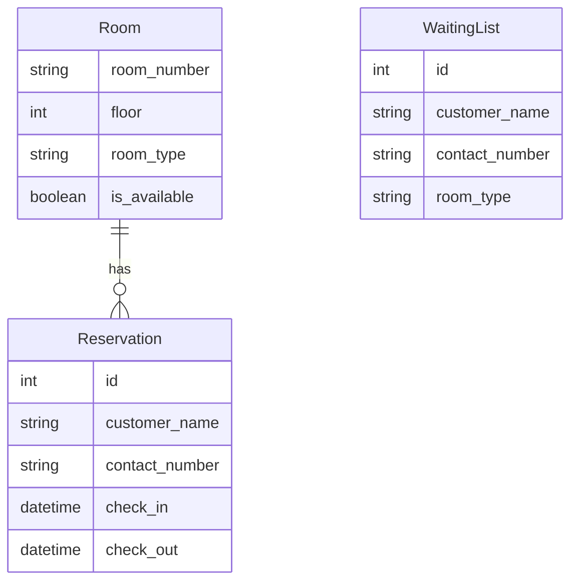
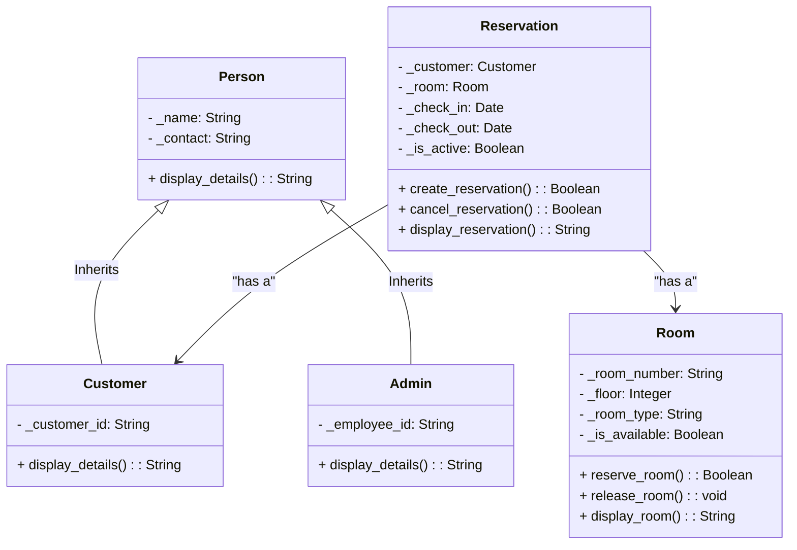

```mermaid
erDiagram
    Room ||--o{ Reservation : "has"
    Room {
        string room_number
        int floor
        string room_type
        boolean is_available
    }
    Reservation {
        int id
        string customer_name
        string contact_number
        datetime check_in
        datetime check_out
    }
    WaitingList {
        int id
        string customer_name
        string contact_number
        string room_type
    }
```

```mermaid
classDiagram
    class Person {
        - _name: String
        - _contact: String
        + display_details(): String
    }
    
    class Customer {
        - _customer_id: String
        + display_details(): String
    }
    
    class Admin {
        - _employee_id: String
        + display_details(): String
    }
    
    Person <|-- Customer : Inherits
    Person <|-- Admin : Inherits
    
    class Room {
        - _room_number: String
        - _floor: Integer
        - _room_type: String
        - _is_available: Boolean
        + reserve_room(): Boolean
        + release_room(): void
        + display_room(): String
    }
    
    class Reservation {
        - _customer: Customer
        - _room: Room
        - _check_in: Date
        - _check_out: Date
        - _is_active: Boolean
        + create_reservation(): Boolean
        + cancel_reservation(): Boolean
        + display_reservation(): String
    }
    
    Reservation --> Customer : "has a"
    Reservation --> Room : "has a"
```
