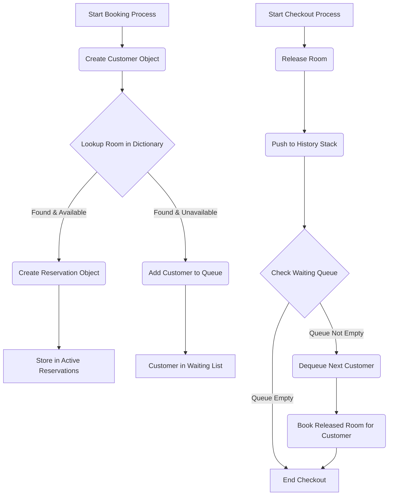

```mermaid
flowchart TD
    Start[Start Booking Process] --> CreateCustomer(Create Customer Object)
    CreateCustomer --> LookupRoom{Lookup Room in Dictionary}
    
    LookupRoom -->|Found & Available| CreateRes(Create Reservation Object)
    LookupRoom -->|Found & Unavailable| AddQueue(Add Customer to Queue)
    
    CreateRes --> ActiveRes[Store in Active Reservations]
    
    AddQueue --> Wait[Customer in Waiting List]
    
    Checkout[Start Checkout Process] --> ReleaseRoom(Release Room)
    ReleaseRoom --> PushHistory(Push to History Stack)
    PushHistory --> CheckQueue{Check Waiting Queue}
    
    CheckQueue -->|Queue Not Empty| Dequeue(Dequeue Next Customer)
    Dequeue --> BookNext(Book Released Room for Customer)
    CheckQueue -->|Queue Empty| End[End Checkout]
    
    BookNext --> End
```
